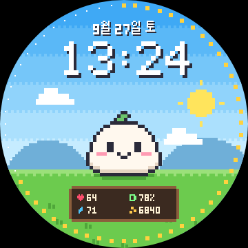
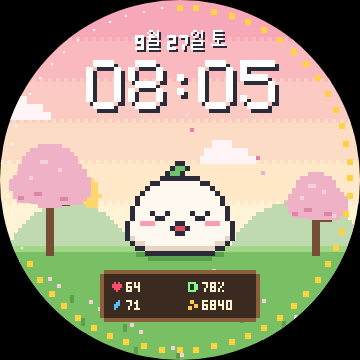
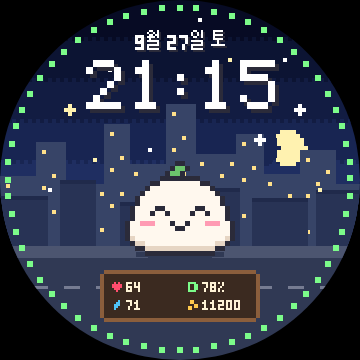
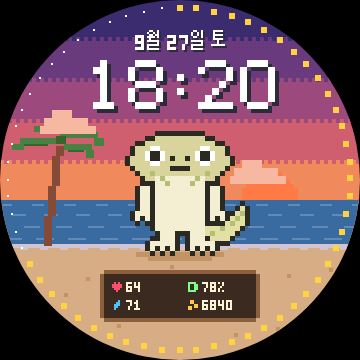
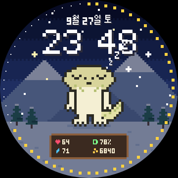
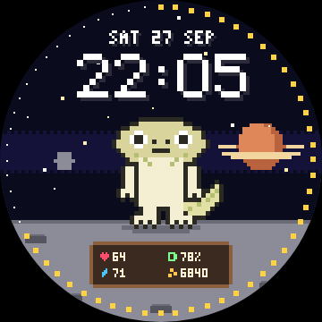
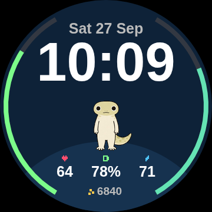
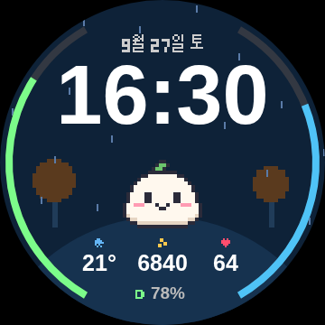
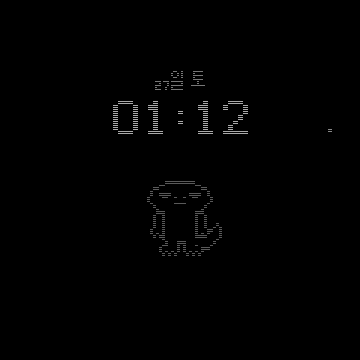

# Pixel Pals: Forerunner 265S 워치페이스

하루를 함께 보내는 픽셀 캐릭터 워치페이스입니다.

<table>
  <tr>
    <td align="center"><br><sub>픽셀아트 · 모찌 · 풀밭 낮</sub></td>
    <td align="center"><br><sub>벚꽃 풍경 · 아침 하품</sub></td>
    <td align="center"><br><sub>도시 밤 · 걸음 목표 달성 웃음</sub></td>
  </tr>
  <tr>
    <td align="center"><br><sub>도롱이 · 바다 저녁</sub></td>
    <td align="center"><br><sub>설산 · 눈 오는 밤 수면</sub></td>
    <td align="center"><br><sub>우주 풍경 · 영어 날짜</sub></td>
  </tr>
  <tr>
    <td align="center"><br><sub>디지털 · 도롱이 이미지</sub></td>
    <td align="center"><br><sub>디지털 · 단풍 실루엣 · 비</sub></td>
    <td align="center"><br><sub>AOD (항상 켜짐)</sub></td>
  </tr>
</table>

<sub>이미지는 브라우저 미리보기 렌더러로 만든 것입니다 (`cd tools/check && npm run readme-images`). 디지털 스타일의 숫자 글꼴은 실제 워치와 조금 다릅니다.</sub>


| 항목 | 선택지 |
|---|---|
| 워치페이스 스타일 | 픽셀아트 / 디지털 |
| 캐릭터 | 모찌(오리지널) / 도롱이 / 매일 랜덤 |
| 캐릭터 스타일 | 워치페이스 따라감 / 픽셀아트 / 디지털(외부 에셋 이미지, 없으면 벡터 그림) |
| 캐릭터 크기 | 작게 / 보통 / 크게 |
| 하늘(시간대) | 자동(일출·일몰) / 아침 / 낮 / 저녁 / 밤 / 심플(검정) |
| 풍경 | 풀밭 / 바다 / 도시 / 설산 / 벚꽃 / 단풍 / 우주 / 계절 자동(봄 벚꽃·여름 바다·가을 단풍·겨울 설산) |
| 강조색 | 자동 / 핑크 / 하늘 / 주황 / 민트 / 보라 / 노랑 |
| 시각 색상 | 흰색 / 강조색 |
| 바깥 링 | 걸음 / 배터리 / Body Battery / 초 / 끄기 |
| 정보 칸 1~4 | 없음 / 심박 / Body Battery / 걸음 / 배터리 / 칼로리 / 거리 / 오른 층수 / 스트레스 / 기온 / 알림 |
| 날짜 | 표시 켜기·끄기, 언어: 워치 언어 따라감 / English / 한국어 |
| 캐릭터 취침·기상 | 취침 21~1시, 기상 5~9시 |
| 날씨 효과 | 켜기 / 끄기 (비·눈 내림, 흐리면 구름 추가) |
| 애니메이션 | 켜기 / 끄기 |

- **시간대 연출** (배경 '자동'): 워치 날씨 정보의 위치로 계산한 실제 일출·일몰 기준. 아침 = 일출 30분 전~3시간 후, 저녁 = 일몰 ±1시간.
  날씨 정보가 없으면 05–10시 아침, 10–17시 낮, 17–20시 저녁, 20–05시 밤
- **밤하늘**: 달이 날짜에 맞게 8단계로 차고 기움, 별 반짝임
- **풍경**: 시간대 색이 모든 풍경에 적용 (밤이면 푸르게, 저녁이면 붉게). 도시는 저녁·밤에 창문 불이 켜지고, 벚꽃·단풍은 꽃잎·낙엽이 흩날림. 디지털 스타일은 풍경을 어두운 실루엣으로 표시
- **날씨**: 워치에 동기화된 날씨로 비·눈 효과와 기온 표시 (기온 칸 아이콘도 날씨에 따라 바뀜)
- **캐릭터 상태**: 깜빡임, 숨쉬기(들썩임), 기상 후 3시간 동안 가끔 하품, 취침~기상 사이 수면(Zzz), 걸음 목표 달성 시 웃는 눈(^ ^)
- **날짜 표시**: 영어 `SAT 27 SEP` / 한국어 `9월 27일 토`. 워치 기본 폰트에 한글이 없는 모델이 있어 한글은 직접 만든 픽셀 글자로 그립니다.
- **정보 배치**: 픽셀아트는 나무판에 칸 1~4를 2줄로, 디지털은 칸 1~3을 가로로 놓고 칸 4를 맨 아래에 작게 표시
- **AOD(항상 켜짐)**: 켜진 픽셀을 최소화하고 매분 위치를 옮겨 번인을 막음. 캐릭터는 외곽선만, 분마다 도는 점 표시

## 폴더 구조

```
garmin-character-face/
├─ monkey.jungle / manifest.xml         전체판 (개인 사용: 모찌·도롱이)
├─ store.jungle / manifest-store.xml    스토어판 (공개 배포용: 모찌만, 앱 이름 Mochi Pixel)
├─ build.ps1 / build.sh                 빌드 스크립트
├─ source/                              공통 코드
│  ├─ MochiFaceApp.mc                   앱 진입점, 설정 변경 처리
│  ├─ MochiFaceView.mc                  화면 그리기 (픽셀/디지털/AOD, 날씨, 달)
│  ├─ Pix.mc                            픽셀 캐릭터·픽셀폰트·한글 날짜 그리기
│  ├─ Smooth.mc                         디지털(벡터) 캐릭터 그리기
│  ├─ Scenery.mc                        풍경 (바다·도시·설산·벚꽃·단풍·우주)
│  ├─ Settings.mc                       설정 저장/불러오기
│  └─ SettingsMenu.mc                   워치 자체 설정 메뉴
├─ source-full/  source-store/          판별 캐릭터 데이터 (Sprites.mc 자동 생성, Assets.mc)
├─ resources/  resources-kor/           공통 문자열(영/한)·아이콘
├─ resources-full/  resources-full-kor/ 전체판 설정 정의·캐릭터 이름·외부 에셋
├─ resources-store/                     스토어판 설정 정의
├─ tools/gen_sprites.py                 캐릭터 그림 정의 → Sprites.mc / sprites.js / 아이콘 생성
├─ tools/fetch_assets.py                외부 에셋 받기·가공 → Assets.mc / assets.js (커밋 안 함)
├─ tools/check_resources.py, tools/check/   컴파일 없이 하는 검사
├─ docs/store/                          스토어 제출 자료 (소개 문구, 아이콘, 스크린샷)
└─ preview/index.html                   브라우저 미리보기
```

## 1. SDK 설치 (처음 한 번)

1. <https://developer.garmin.com/connect-iq/sdk/> 에서 **SDK Manager**를 받아 실행합니다.
2. Garmin 계정으로 로그인합니다.
3. **SDK** 탭에서 최신 SDK를 설치하고 *Use as Active SDK*를 누릅니다.
4. **Devices** 탭에서 **Forerunner 265S**(원하면 265도)를 다운로드합니다.
5. (선택) VS Code에 **Monkey C** 확장을 설치합니다.

Java가 필요하다는 메시지가 나오면 JDK 17 이상을 설치하세요.

## 2. 빌드와 시뮬레이터

PowerShell에서 `garmin-character-face` 폴더로 이동한 뒤:

```powershell
.\build.ps1 -Run
```

- 빌드 결과: `bin\PixelPals.prg` (전체판)
- 스토어판: `.\build.ps1 -Store -Run` → `bin\MochiPixel.prg`, 업로드용 패키지는 `.\build.ps1 -Store -Release` → `bin\MochiPixel.iq`
  (제출 자료는 [`docs/store/listing.md`](docs/store/listing.md))
- 개발자 키: 기존 `keys\developer_key.der`를 그대로 씁니다. 없으면 자동으로 만듭니다.
- 실행 정책 오류가 나면: `powershell -ExecutionPolicy Bypass -File .\build.ps1 -Run`

시뮬레이터에서 확인할 것:

| 확인 항목 | 시뮬레이터 메뉴 |
|---|---|
| 설정 바꾸기 | File → Edit Persistent Storage → Edit Application.Properties data |
| AOD 화면 | Settings → Display Mode → Always On / 또는 Low Power Mode |
| 시간대별 배경 | Simulation → Time Simulator |
| 심박·걸음 값 | Simulation → Activity Data |

## 3. 워치에 설치 (사이드로드)

1. 워치를 USB로 PC에 연결합니다.
2. 탐색기에서 `Forerunner 265S\Internal Storage\GARMIN\APPS` 폴더를 엽니다.
3. `bin\PixelPals.prg`를 복사합니다.
4. 케이블을 뽑으면 워치가 앱을 설치합니다.
5. 워치에서 시계 화면을 길게 누르기 → **워치 페이스** → **Pixel Pals(픽셀 친구들)** 선택.

## 외부 캐릭터 에셋 (디지털 캐릭터 스타일)

캐릭터 스타일이 **디지털**이면 직접 그린 벡터 그림 대신 이미지를 씁니다.

| 캐릭터 | 에셋 |
|---|---|
| 도롱이 | `assets/dorongi.png` (저장소에 포함, 흰 배경은 자동으로 지움) |
| 모찌 | 오리지널이라 벡터 그림 그대로 |

- `tools/fetch_assets.py`가 이미지를 크기별(66/88/110/132px) 비트맵과 AOD용 외곽선으로 만듭니다.
  `build.ps1`, `build.sh`, CI가 빌드 전에 자동으로 실행합니다 (Python + Pillow 필요, 없으면 설치 시도).
- 가공 결과물(`source-full/Assets.mc`, `resources-full/drawables/`)은 빌드 때마다 만들어서 커밋하지 않습니다.
- 이미지를 구하지 못하면(파일 없음, Pillow 없음) 그 캐릭터는 벡터 그림으로 대신 그려서 빌드는 항상 됩니다.
- **도롱이 이미지는 표정 5가지**(기본, 깜빡임, 하품, 수면, 목표 달성 웃음)를 원본 그림에서 자동으로 만들어 씁니다.
  원본의 눈·입을 머리 색으로 지우고 같은 선으로 다시 그립니다 (`tools/fetch_assets.py`의 `DORONGI_FACE` 좌표).
- VS Code에서 바로 빌드하려면 먼저 `python tools/fetch_assets.py`를 한 번 실행해 `source-full/Assets.mc`를 만드세요.

**도롱이 이미지:** `assets/dorongi.png`(저장소에 포함)를 씁니다. 다른 그림으로 바꾸려면 이 파일을 교체하고 빌드하세요.
전신이 보이고 배경이 흰색이거나 투명한 이미지면 됩니다.

## CI 자동 빌드 (GitHub Actions)

`main`에 푸시하거나 PR을 열면 `.github/workflows/build.yml`이 실행됩니다.

- **check**: 스프라이트 생성 결과가 커밋된 파일과 같은지, 미리보기 JS 문법이 맞는지 검사합니다. 설정 없이 항상 돕니다.
- **build**: Connect IQ SDK를 받아 FR265S / FR265용으로 실제 컴파일하고, `.prg` 파일을 Actions 결과물(`PixelPals-prg`)로 올립니다.
  이 결과물을 받아 바로 워치에 복사해도 됩니다.

build 작업을 켜려면 저장소 **Settings → Secrets and variables → Actions → New repository secret**에서 두 값을 등록하세요.

| 이름 | 값 |
|---|---|
| `GARMIN_USERNAME` | Garmin 계정 이메일 |
| `GARMIN_PASSWORD` | Garmin 계정 비밀번호 |

SDK와 기기 파일은 Garmin 계정으로 로그인해야 받을 수 있어서 필요합니다. 비밀값이 없으면 build 작업은 경고만 남기고 건너뜁니다.
계정에 2단계 인증이 켜져 있으면 로그인이 실패할 수 있습니다.

## 컴파일 없이 하는 검사

| 명령 | 내용 |
|---|---|
| `python tools/check_resources.py` | 문자열(영/한)·설정 키·기본값·선택지 수·리소스 ID 교차 검사 (빌드 스크립트가 자동 실행) |
| `cd tools/check && npm ci && npm run lint` | 모든 `.mc` 파일 문법 검사 (Monkey C 파서) |
| `cd tools/check && npm run matrix` | 설정 조합 전체 렌더링: AOD 켜진 픽셀 비율·2분 연속 점등 검사, 그리기 호출 수, 모아보기 이미지(`tools/check/out/`). Playwright 필요 |

**현재 점검 결과 (미리보기 기준)**
- AOD 켜진 픽셀: 모든 조합 3% 이하 (가이드 10%), 2분 연속 켜진 픽셀 0개 (매분 짝/홀 줄 마스크 + 위치 이동)
- 그리기 호출: 픽셀아트 배경은 고정 부분을 버퍼 비트맵에 한 번만 그려 두고 재사용 (API 4.0+). 매초 다시 그리는 건 캐릭터·글자·별·구름뿐
- 메모리: 그림 데이터 약 11KB (앱 메모리). 캐릭터 비트맵(최대 132px)과 배경 캐시(16색)는 그래픽 메모리 사용

## 4. 설정 바꾸는 방법

- **워치에서**: 시계 화면 길게 누르기 → 워치 페이스 → Pixel Pals → **사용자 지정(Customize)**
  항목을 누르면 선택지 목록이 열리고, 고르면 바로 저장됩니다.
- **휴대폰에서**: Garmin Connect 앱 → 기기 → 워치 페이스 → Pixel Pals → 설정
  (Connect IQ 스토어로 설치한 경우에만 표시됩니다. 사이드로드한 앱은 워치 메뉴를 사용하세요.)

## 5. 캐릭터 수정·추가

모든 그림은 `tools/gen_sprites.py` 한 파일에 있습니다.

- **픽셀 캐릭터**: 문자 격자로 그립니다. `K` = 외곽선(AOD에서 이 픽셀만 표시), `.` = 투명, 그 외 문자 = `palette`의 색.
  도롱이처럼 도형을 채운 뒤 외곽선을 자동으로 두르는 방식도 쓸 수 있습니다(`build_dorongi_grid`).
- **디지털 캐릭터**: `SMOOTH` 목록에 원·타원·호·선 도형으로 그립니다 (100x100 상자, 발바닥 y=100).
- **한글 글자**: `HANGUL`에 7x10 픽셀로 있습니다.

수정한 뒤 `python tools/gen_sprites.py`를 실행하면 워치용 `source-full/Sprites.mc`·`source-store/Sprites.mc`와
미리보기용 `preview/sprites.js`가 함께 갱신됩니다 (`build.ps1`도 자동 실행).
새 캐릭터를 추가하면 캐릭터 정의에 `label`(이름 문자열 ID)을 넣고, `resources-full/settings/settings.xml` 목록과
이름 문자열(`resources-full*/strings/characters.xml`)을 추가하세요. 오리지널 캐릭터라면 `"store": True`로 스토어판에도 넣을 수 있습니다.

## 참고

- 도롱이는 사용자가 제공한 캐릭터 그림을 바탕으로 합니다. 원작자 권리를 확인하기 전에는 스토어에 공개 배포하지 말고,
  모찌만 들어간 **스토어판**(`store.jungle`)을 올리세요. `check_resources.py`가 스토어판에 다른 캐릭터가 섞이지 않았는지 검사합니다.
- 저작권 문제가 될 수 있는 팬아트 캐릭터는 제거했습니다 (이전 상태는 `backup/fanart-characters` 브랜치에 보관).
  `check_resources.py`가 관련 이름이 다시 들어오지 않았는지 검사합니다.
- 워치페이스는 고전력 모드(손목을 들었을 때 약 10초)에만 1초마다 갱신되고, 그 외에는 1분마다 갱신됩니다. 애니메이션은 손목을 든 동안에만 움직입니다.
